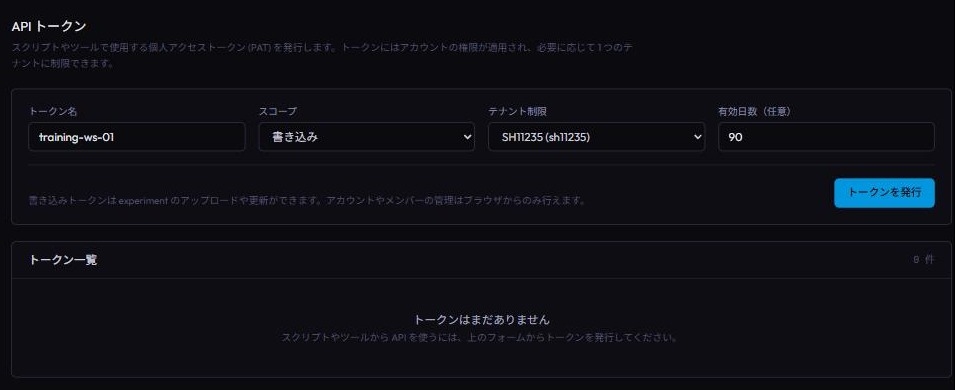
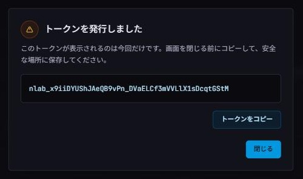
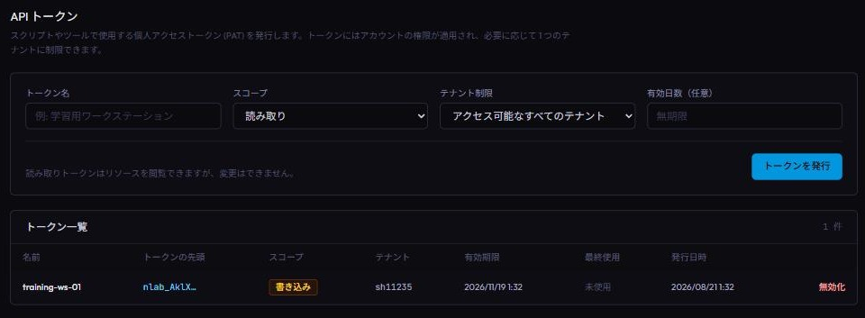

自作の NNUE 実験管理アプリ [nnue-lab](https://nnue-lab.sh11235.com/) のデータを、ブラウザを使わずに出し入れできるようにしました。
追加したのは次の 4 つです。

- **公開 API**: 実験の一覧・取得・アップロード・メタデータ更新ができる HTTP API
- **API token (personal access token)**: 上の API を認証するための credential。アカウントページから発行できる
- **公開ガイド**: [https://nnue-lab.sh11235.com/developers/skill.md](https://nnue-lab.sh11235.com/developers/skill.md) — curl 例つきの手順書で、AI agent にそのまま読ませて使える形式
- **remote MCP server**: `https://nnue-lab.sh11235.com/mcp` — Claude Code や Codex から実験データを直接参照できる

CLIから作業が完結するようになるため、この機能を使えば実験の管理をCoding Agentに任せて、学習終了後の実験データアップロードやメモの編集を自動で行わせる事が出来ます。
全データを remote （nnue-lab）に置いておくと、複数マシンを使う場合にも過去実験の参照が簡単になります。
元々自分専用では使っていたのですが、このリリースをもって他の nnue-lab ユーザーにも開放されます。

## 公開 API と 2 つの利用経路

公開APIでは実験の一覧取得・詳細取得・アップロード・メタデータ更新が出来ます。閲覧できるのは、自分がアクセス権を持つ実験と公開実験です。アップロードや更新は、自分が権限を持つ tenant のデータに限られます。

利用経路は 2 つあります。1 つ目は **HTTP を直接叩く経路**で、curl を手で打っても、スクリプトに書いても、AI agent にやらせても構いません。skill.md はこの経路の手順書で、agent に読ませるとそのまま使えます。2 つ目は **MCP** で、agent が型付き tool を直接呼びます。

まずは 1 つ目の経路の最小例です。

```bash
export NNUE_LAB_TOKEN="nlab_..."

curl -H "Authorization: Bearer ${NNUE_LAB_TOKEN}" \
  "https://nnue-lab.sh11235.com/api/tenants/<tenant>/experiments"
```

この記事の例は curl で書きますが、ただの HTTP API なので client は何でも構いません (Postman のような GUI client でも叩けます)。Coding Agent に使わせるならコマンドで完結する curl が自然です。

なお curl 例は bash 構文です。Windows では WSL や Git Bash でそのまま使えます。PowerShell で実行する場合は次の 3 点を読み替えてください。

- `curl`: PowerShell 7 ではそのまま Windows 同梱の curl が動きます。Windows PowerShell 5.1 では別コマンドの別名になっているため `curl.exe` と書きます
- `${NNUE_LAB_TOKEN}`: `$env:NNUE_LAB_TOKEN` に読み替えます。
- 行末の `\` (行継続): `` ` `` に読み替えるか、1 行で書きます

skill.md と MCP について補足します。どちらも使うかどうかは任意です。

- **skill.md** はただの markdown 手順書です。AI agent に読ませると、agent が curl を組み立てて API を叩けるようになります。主要 endpoint の curl 例をカバーします
- **MCP** はプロトコル統合で、agent が型付き tool を直接呼びます。実験の一覧・詳細・学習履歴の取得、複数実験の比較、lineage (継続学習の親子関係) の取得と、メタデータの更新ができます

機能としては skill.md (curl) だけですべて足りていて、MCP は必須ではありません。MCP の利点は使い勝手です — agent が curl を組み立てる代わりに定型の tool を呼ぶのでパラメータの間違いが起きにくく、シェルを実行できない環境の agent でも使えます。token の面では、curl 経由でも token を環境変数から参照すれば、curl コマンド自体に平文を埋め込まずに済みます。MCP では client が設定に従って Authorization header を付けるため、通常の MCP tool 呼び出しで agent が token をコマンドや prompt に埋め込む必要がありません。対話的に実験を眺める用途なら MCP、スクリプトに組み込む自動アップロードなら curl、と使い分けるのが実用的です。

どちらか一方を選ぶ必要はありません。実験の参照・比較やメタデータ更新には型付き tool を呼べる MCP が便利で、アップロードなど現時点で MCP が対応していない操作やスクリプトへの組み込みには skill.md (curl) が使えます。Coding Agent から継続的に nnue-lab を利用するなら、両方を登録しておくのがおすすめです。

## token を発行する

ログイン後のアカウントページに API tokens セクションがあります。名前・スコープ (読み取り / 書き込み)・テナント制限 (任意)・有効日数 (任意、1〜365 日) を指定して発行します。



使用先が 1 つの tenant に限られる場合は、テナント制限を指定するのがおすすめです。指定すると、その token は指定 tenant の API しか叩けなくなります。漏洩したときに効く範囲を絞るための保険で、チーム利用でチームテナントと個人テナントを使い分けているような場合に有効です。複数の tenant で使う場合や、他のユーザーの公開実験 (例: 私の sh11235 tenant) を API や MCP から参照する場合は、制限を空 (指定なし) にしてください。

発行すると平文の token が **一度だけ** 表示されます。この画面を閉じると再表示できないので、その場でコピーして保存します。この記事の curl 例と推奨する MCP 登録例は環境変数 `NNUE_LAB_TOKEN` から token を読む前提なので、OS ごとに次の場所に置いておくのが楽です。

Linux / macOS / WSL では `~/.bashrc` (zsh なら `~/.zshrc`) に 1 行足します。

```bash
export NNUE_LAB_TOKEN="nlab_..."
```

Windows では PowerShell で一度実行すれば、ユーザー環境変数として永続化されます (反映は新しいターミナルから)。

```powershell
[Environment]::SetEnvironmentVariable("NNUE_LAB_TOKEN", "nlab_...", "User")
```

PowerShell のコマンド履歴に token を残したくない場合は、GUI の「システムのプロパティ → 環境変数 → ユーザー環境変数」に `NNUE_LAB_TOKEN` を追加してください。OS の再起動は不要ですが、起動済みのターミナルには反映されないので、ターミナルアプリを開き直してください (Windows Terminal は新規タブでは反映されず、アプリごと開き直す必要があります)。



発行済みの token は一覧で確認でき、いつでも失効できます。



token は発行者本人として認証され、リクエスト時点の tenant membership・role・tier capability がそのまま適用されます (本人ができる以上のことはできません)。読み取り token はリソースの閲覧のみ、書き込み token は加えて実験のアップロード・更新と、条件を満たす場合の削除 (uploader 本人・owner のみ) ができます。アカウント管理・メンバー管理・token 管理自体は token では操作できず、ブラウザのセッション専用です (token が漏洩しても、その token 自身で増殖や失効妨害ができない設計です)。

## シナリオ 1: 学習終了時に実験を自動アップロードする

学習スクリプトの末尾で experiment.json をアップロードする使い方です。書き込み token を使い、multipart の `file` フィールドで送ります。

```bash
curl --fail-with-body \
  -H "Authorization: Bearer ${NNUE_LAB_TOKEN}" \
  -F "file=@runs/exp-001/experiment.json;type=application/json" \
  "https://nnue-lab.sh11235.com/api/tenants/<tenant>/experiments"
```

アップロードは冪等に作ってあり、再実行しても安全です。

- 新規なら `201`
- 同一内容の再送なら `200` + `is_duplicate: true` (何も変わらない)
- 既存実験のより完全な snapshot (学習途中に一度上げて、完走後に上げ直した場合など) なら `200` + `is_duplicate: false` で既存レコードが更新される

つまり「学習途中に `experiment_status: running` で一度上げてグラフを眺め、完走したら同じコマンドで確定版を上げる」という運用ができます。

## シナリオ 2: AI agent から実験データを参照する

MCP で接続すると、agent に「先週の実験と loss を比較して」のような依頼ができます。主な tool は次のとおりです。

- `list_experiments`: 実験の一覧 (ソート・フィルタ・ページング付き)
- `get_experiment`: 実験 1 件のメタデータ取得
- `get_experiment_history`: 学習履歴 (loss / accuracy の推移) の取得
- `compare_experiments`: 複数実験 (最大 10 件) の学習履歴の比較
- `get_lineage`: 継続学習の親子関係チェーンの取得
- `update_experiment_metadata`: 名前・タグ・メモ等の更新 (書き込み token のみ)

私の公開実験や自分の過去実験データを参照させて、次の実験計画を練るというような使い方が出来ます。`experiment.json` に記録された学習条件や commit、実行 command まで確認できるため、過去の実験を具体的な条件まで掘り下げられます。

### Claude Code のセットアップ

user scope (自分の全プロジェクトで使う) で登録します。

```bash
claude mcp add --scope user --transport http nnue-lab \
  https://nnue-lab.sh11235.com/mcp \
  --header "Authorization: Bearer ${NNUE_LAB_TOKEN}"
```

環境変数を使わず、`Bearer nlab_...` と token を直接指定することもできます。その場合、token は shell のコマンド履歴と user scope のローカル設定ファイルに平文で残る可能性があるため、履歴と設定ファイルの取り扱いに注意してください。

skill.md を使う場合は、SKILL として保存するだけです。

```bash
mkdir -p ~/.claude/skills/use-nnue-lab-api
curl --fail --location \
  --output ~/.claude/skills/use-nnue-lab-api/SKILL.md \
  https://nnue-lab.sh11235.com/developers/skill.md
```

PowerShell の場合は以下です。

```powershell
New-Item -ItemType Directory -Force `
  -Path "$HOME\.claude\skills\use-nnue-lab-api" | Out-Null
curl.exe --fail --location `
  --output "$HOME\.claude\skills\use-nnue-lab-api\SKILL.md" `
  https://nnue-lab.sh11235.com/developers/skill.md
```

### Codex のセットアップ

`~/.codex/config.toml` に登録されます。

```bash
codex mcp add nnue-lab \
  --url https://nnue-lab.sh11235.com/mcp \
  --bearer-token-env-var NNUE_LAB_TOKEN
```

環境変数を使わない場合は、`~/.codex/config.toml` の同エントリに静的 header として token を直接書くこともできます。その場合、token はローカル設定ファイルに平文で保存されるため、`config.toml` を共有したりコミットしたりしないでください。

```toml
[mcp_servers.nnue-lab]
url = "https://nnue-lab.sh11235.com/mcp"
http_headers = { Authorization = "Bearer nlab_..." }
```

skill.md を自分のすべてのレポジトリで使う場合は、user scope の `$HOME/.agents/skills` に保存します。

```bash
mkdir -p ~/.agents/skills/use-nnue-lab-api
curl --fail --location \
  --output ~/.agents/skills/use-nnue-lab-api/SKILL.md \
  https://nnue-lab.sh11235.com/developers/skill.md
```

PowerShell の場合は以下です。

```powershell
New-Item -ItemType Directory -Force `
  -Path "$HOME\.agents\skills\use-nnue-lab-api" | Out-Null
curl.exe --fail --location `
  --output "$HOME\.agents\skills\use-nnue-lab-api\SKILL.md" `
  https://nnue-lab.sh11235.com/developers/skill.md
```

特定のレポジトリだけで使う場合は、そのレポジトリのルートで次を実行します。

```bash
mkdir -p .agents/skills/use-nnue-lab-api
curl --fail --location \
  --output .agents/skills/use-nnue-lab-api/SKILL.md \
  https://nnue-lab.sh11235.com/developers/skill.md
```

tatara や BulletOu などのレポジトリに repo scope で置く場合、この `SKILL.md` 自体は公開ガイドなのでコミットして共有できます。ただし、`NNUE_LAB_TOKEN` の値を `SKILL.md` やスクリプト、その他のレポジトリ内のファイルに書いてコミットしないようご注意ください。

## おわりに

人の手が介入する余地を減らすと効率化されていって人間がもっと本質的なところに時間を使えます。
今時の管理画面やソフトは人ではなくLLMが参照・操作するものなので、それを前提とした機能開発をしていきたいですね。
