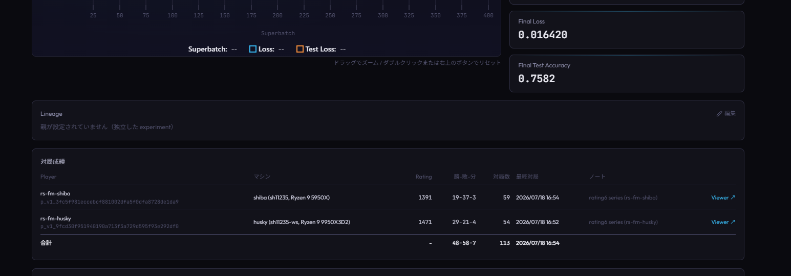
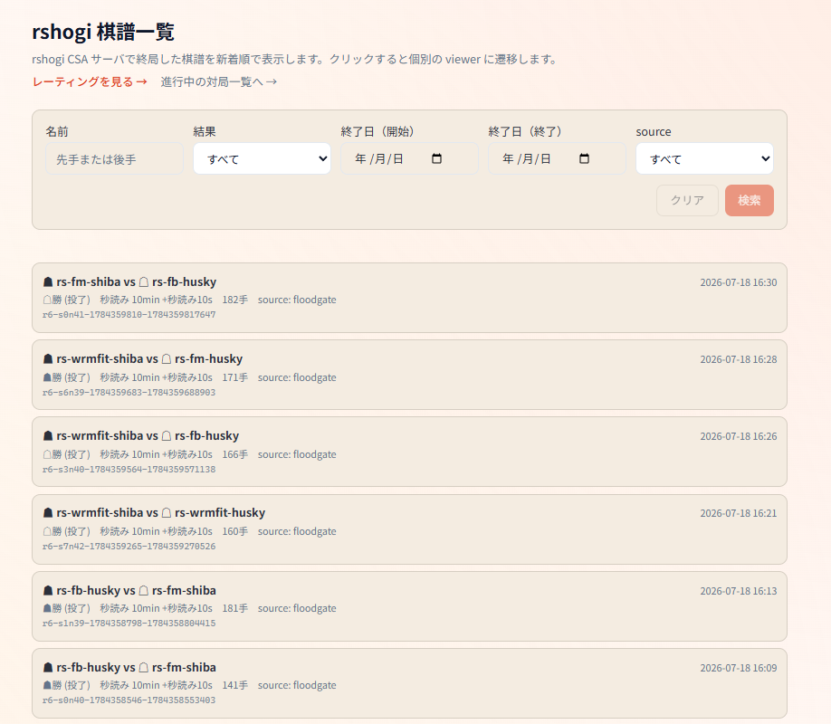
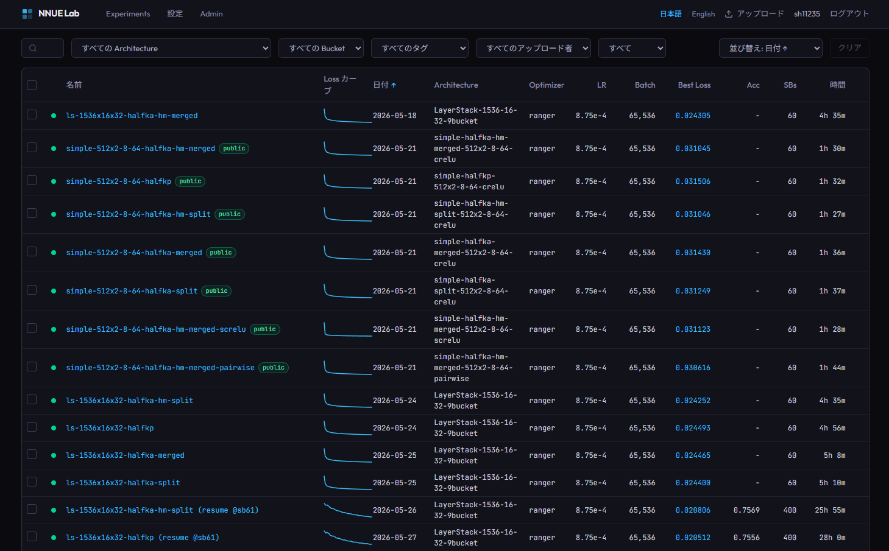
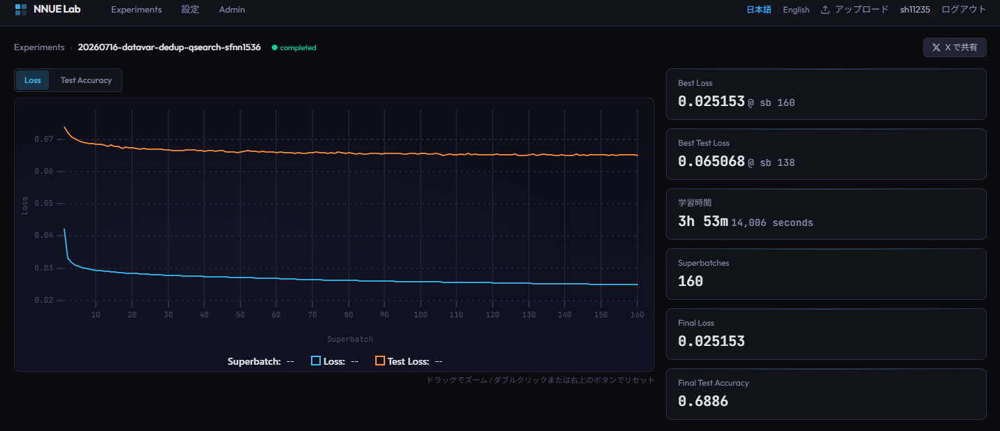

約1年、将棋に関するソフトウェア開発をしました。
最初は将棋のルール理解すら怪しかったのですが、気づいたら趣味の1つ（ときに可処分時間のほとんど）になりました。
自作の将棋AIは自分はおろか将棋が強い知り合いより強くなり、先月将棋AIの対局サイトのFloodgateで試験中のアーキテクチャを試しに流したところ瞬間レート1位をとりました。
定跡は薄いのですが上位勢ともある程度マッチしていて、先手はほぼ勝ち、後手番でも Sora_Ginko など上位にいる相手に勝つこともありました。

<blockquote class="twitter-tweet"><a href="https://twitter.com/ramu_shogi/status/2074244687691759627">https://x.com/ramu_shogi/status/2074244687691759627</a></blockquote>

## 作ってきたもの

（NNUE系）将棋AIを動かすには将棋エンジン（YaneuraOu）、評価関数（水匠5、AobaNNUE）、対局・検討用のGUI（ShogiHome）など複数の要素が必要です。
これら全部を自前で用意するべく

- 将棋エンジンとしてはrshogi
- 評価関数トレーナーとしてtatara
- GUI（webアプリ）としてラム将棋
- 実験管理アプリとして nnue-lab

を作ってきました。

また開発を支えるツールがrshogiレポジトリに50個以上あります。
主に評価関数を作る（ための教師データを作ったり加工したりする）ためのツールと、出来た評価関数・エンジンの改修を対局で評価するためのツールです。
全てRust製で、なるべくパフォーマンスを意識して作っているので Python で書くスクリプトより性能が期待できるものが揃っています。
よく使われそうなものは DL系モデルで 棋譜の評価値を書き変えるツールかなと思います。
おそらくは世の中である既存スクリプトよりも高速に動きます。
https://github.com/SH11235/rshogi/blob/main/crates/tools/docs/rescore_psv.md

## これからやること

### アプリ

自分に必要なもの、面白いと思うものを作ります。

#### ラム将棋

https://ramu-shogi.sh11235.com/

外部からある程度任意のNNUE系評価関数を使ってユーザー端末で解析できるアプリで、ここまで機能面を作っているアプリは他には無いと思っています。これがユーザーが欲しいものかというと多くの場合はズレているとは思いますが、技術的にはなかなか面白いものです。
一般ユーザー向け機能のアップデートはあまりやってないですが、プリセットで配布している評価関数が古いので比較的最近のLayerStackモデルを追加で配布して検討で使えるようにしようかなと考えています。
将棋AIに集中していてこのアプリで遊ぶことをあまりやれていないので、時間を取れたらユーザー視点でのUI/UX改善をやりたいとは思っています。

#### ラム将棋 / nnue-lab

個人用としては自作のcsaサーバーと連携してAI同士の対局ログやライブ対局を見れるようなページを作りました。
要はセルフFloodgateです。
この対局ログをnnue-labに自動連携する機能も作り、本番候補モデルの実験ノートとその対局ログがnnue-labに全部集約できるようになりました。

事前に将棋エンジンバイナリと評価関数セットを登録しておいて、CPUが余っている限り自動で接続して対局評価を回し続ける、みたいな環境を目指していますが、本格活用するにはクラウドでCPUリソースをずっと確保して24時間365日回し続けるということが必要で、そこまで趣味にお金をかけられるだろうか・・・？という戦いになっています。
一時期回していた記録が https://ramu-shogi.sh11235.com/rshogi-viewer/ で見れます。

#### nnue-lab

https://nnue-lab.sh11235.com/

最近一般公開をし、誰でも実験データを登録・管理出来るようになりました。

<blockquote class="twitter-tweet"><a href="https://twitter.com/ramu_shogi/status/2087150170102452604">https://x.com/ramu_shogi/status/2087150170102452604</a></blockquote>

前にやった実験が何だったか振り返りやすいのと、学習のlossやaccuracyのグラフ化をやってくれます。
サンプル: https://nnue-lab.sh11235.com/t/sh11235/experiments/01JTNNB0ILFDD29AF43C3F1C8A

bullet-shogi/BulletOu/tatara ユーザーは是非！ご活用ください！
将棋AI開発者人口がどれほどかというところはありますが、学習レシピ共有サイトとして nnue-lab ユーザーが増えるとNNUE系の進化が加速するのかな、などと思っています。ただ、大会を考えるとなるべく隠しておきたいものかもしれませんね。
以前まではNNUE系実験といえば nodchip さんのブログが唯一のソースだと思いますが、nnue-labだと構造化された形式で誰でもレシピを公開できるため、再現実験もやりやすくなっています（教師データは各自のローカル環境に依存しますが）。
評価関数・エンジンの販売は将棋AIの大会後によくされていますが、追加でnnue-labでもレシピ公開をされると嬉しいなと思います。

#### 他

アプリは実用性にフォーカスして開発者（ほぼ自分）専用の志向が強いですが、誰でも楽しめる、面白いものも作ってみたいです（将棋関連とも限らなくなりそうですが）。

### 探索部

YaneuraOuと同じアルゴリズムを一度達成することをもってバグを取り切れました。
今は安心して自由な強化が出来る状態です。
YaneuraOuも参考にしているStockfishの実装も、計測しつつ有用だったものは自作エンジンに取り込むというのをやりました。
探索木を変えない純粋なアルゴリズム改善はCoding Agentの助けでかなりやりやすくなりましたが、追加で枝刈りのステップは改良の余地があるかもしれないのでチャレンジしてみたいです。
探索パラメータのSPSAで埋もれる差にしかならない可能性もあり、慎重にやるならばSPSAを何日か回してから対局評価を何千局かやる、というステップが必要なため、もう少し軽量評価で確実な強化が出来れば実験が捗るのにと考えているところです。

### 評価関数・推論部

推論部は評価関数のアーキテクチャごとに実装が必要で、実験的なアーキテクチャをいくつか用意しています（LayerStackのPSQTあり、threatモデルなど）。
NPSを落とすが読みの精度が上がるアーキテクチャは選択肢があり、最も簡単なのはモデルサイズを大きくすることです。
例えば1スレッド、1秒固定の秒読みでの対局評価だとNPSを落とす施策は弱化する傾向があります。
depth 指定での対局評価では表現力が上がっている分強い結果となる期待があり、実際depth指定の評価をクリアした場合には追加の評価をします。
例えば32スレッド、持ち時間を本番相当のフィッシャー方式とした場合だとNPSを落とす施策が強くなる結果も見られます（ただ、これは1スレッド対局と比べて対局数が桁違いに小さいので統計的に有意とは言えないところです）。
同じアーキテクチャ同士は秒読み評価で良いと考えていますが、そうで無い場合の評価は慎重にやりたいです。
とは言え全てをフルパワー設定で対局評価するのは計算資源や時間の制限で現実的ではありませんので、アーキテクチャを固定して学習レシピを変え、そのアーキテクチャでの暫定ベストのモデルが出来たら別アーキテクチャの暫定ベストモデルと対局評価する、というようなやり方で複数のアーキテクチャを実験・検討しています。

### NNUE学習ツール

[bullet-shogi](https://github.com/SH11235/bullet-shogi)の開発から始まり、[tatara](https://github.com/SH11235/tatara)を作りました。
2025年のNNUE学習ではnodchipさんがforkしたnnue-pytorchを使うのがスタンダードになっているようでしたが、自分の持っているGPUでは学習に何日もかかり、新参者としてはこんなペースでは実験が全く進まないというところに課題感がありました。
[Stockfish](https://github.com/official-stockfish/stockfish)以外のチェスエンジンも調査していて、[Reckless](https://github.com/codedeliveryservice/Reckless)というRust製のチェスエンジンがあり、RecklessのNNUE学習ツールで [Bullet](https://github.com/jw1912/bullet)を使っているという記述があったため、これに着目しました。どうやら、 nnue-pytorchよりも高速に学習出来るようで、これを将棋用にforkして作ったのがbullet-shogiでした。
tataraではbullet-shogiまでの知見とこういう最適化に異様に詳しいCoding Agentの力で、2025年比では爆速でNNUE学習が出来るツールに仕上がりました（[過去記事](https://note.com/ramu_shogi_dev/n/n44fa570ac214)）。
今ではnodchipさんにも使ってもらえて（嬉しい）、bullet-shogiはやねうらおさんによるやねうら王公式学習ツール[BulletOu](https://github.com/yaneurao/BulletOu)というフォークに派生し、tataraのFeature Transformerの因子分解やwin-rate-model系のlossオプション、レシピの既定値が取り込まれたり、学習速度・accuracyの比較リファレンスとしてtataraが使われたりするなど、将棋AI開発者にもいい影響を与えられたと思います。

既存のパラメータの組み合わせを実験するだけでもまだまだやることがあるのですが、新しいアーキテクチャの追加や学習パラメータの追加・調整、パフォーマンス最適化は継続してやります。
手元の最善レシピをデフォルト値にするというのはまだ意図的にやっていないところがあって、例えば win-rate-modelはオンにした方が強い結果が続いているのですが、明示的にオフにしての実験をしやすくするためにオプションとしたままです。
nnue-labでレシピ公開してそれを真似てもらうなどする方がバランスがいいかな、などと思っているところで、検討中です。

### 教師データ

今やNNUE学習は律速ではなく、いかに質の良いデータをいかに多く用意できるかが課題と考えています。
教師データの加工による棋力への影響については過去に公開実験を書きました（[過去記事](https://note.com/ramu_shogi_dev/n/nb96e4014ee01)）。
現状良しとされている手法の1つは奏乗チームやnodchipさんがやっていたように生成済みの棋譜をDL水匠（もしくは複数のDL系モデルのアンサンブル）で評価値を書き換えることです。
知識蒸留と呼ばれていますね。
自前で、DL水匠に代わるDL系モデルの作成をいくらか実験していますがまだいい結果は何も無いです。
DL水匠は15ブロックですが、10ブロックでNNUE系教師データのラベリング用としては十分な精度のモデルが作れると、NNUE系教師データを増やすコストが下げられるので、これを目指せるといいかなと考えています。
そもそもなぜDL水匠がNNUE系教師で有用なのか、どういったDL教師が、どういった評価値の付け方が教師データに適しているのか、分からない事が多くあります。ここも何か知見が得られるといいなと思っています。
今はNNUE系の学習でもそうですがDL系は当然GPUを使うため手元の計算資源ではなかなか実験する余力が無いところです。
対局で強いDL系のモデルを作るにはもう何段階か覚悟（GPUへの投資・長時間稼働）をしないといけないと考えているため当面はNNUE系を主体として考えています。

### 定跡

将棋AI界では有名な角換わり定跡を知らないので、Floodgateでは相手のTuyouraOuが先手で角換わりに進行した試合で、相手は107手目まで定跡・時間消費ゼロでほぼ勝ちの局面まで進行し、こちらが後手でボコボコにされていました。
ここは定跡で対策するしか無いと思っており、自前定跡強化が必要なところです。
簡単には、Floodgate棋譜から真似すればいいところではあります。
評価関数・探索部をまだまだ伸ばせると思っているので、落ち着いたらどこかで集中してやりたいです。

## おわりに

仕事などの都合で出られて無いですが一回くらい将棋AIの大会には出てみたいです。
定跡が整備されること自体は楽しく・面白いと思いますが、大会で勝つことだけなら評価関数はそこそこに、定跡強化に力を入れる方が現実的には勝ちやすいだろうというのがあんまり面白くは無いという気持ちです（定跡はCPU or GPUパワーで掘り続ける作業になると思うので、探索部や評価関数ほどガチャガチャ実験をする余地が少ない）。
誰かが最強になって、いつか将棋に結論が出たらいいので、自分が大会に出ること自体の優先度はそこまで高く無いです。
bullet-shogi、tataraも隠して黙々やっていたら、NNUE系の知見を自分だけ最速で集められて出し抜けるみたいな可能性はあったのかもしれませんね。
再来年のWCSC38では入玉宣言法が24点法に変更になるようで、これで具体的にどのような影響があるのかは分かりませんが、環境の変化があるのはよい刺激でしょうね。
コンピュータ将棋はそのうち興味が移ったり、仕事が忙しくなったりで触れなくなるかもしれないですが、今作ったソフト基盤とデータがあれば復帰も容易かなと思っています。
ルール変更への追従は時期が近づいたときにまだ時間があったら考えます。
